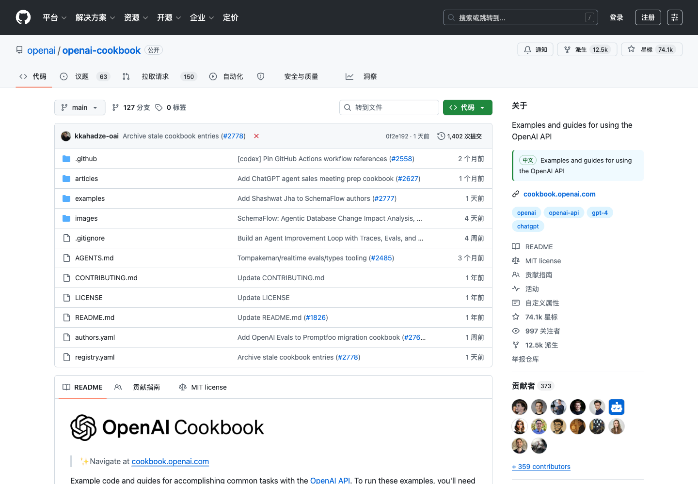

# GitHub 中文语义助手

Read GitHub in Chinese without destroying the technical meaning.

GitHub 中文语义助手是一个 Manifest V3 Chrome 扩展，面向每天阅读 GitHub 的中文开发者。它不走浏览器机翻路线：GitHub 固定功能词使用本地词典，README、仓库介绍、Issue 和 Pull Request 讨论使用你配置的 OpenAI-compatible 模型，并带有技术术语表和专名保护。

## Why It Exists

普通网页翻译最大的问题不是“不够中文”，而是把技术语义翻坏：

- `pull request` 被翻成拉动请求或请求
- `issue` 被翻成问题，丢掉 GitHub 的协作语义
- `agent` 被翻成代理，误伤 AI 智能体语境
- `RAG`、`embedding`、`tool calling` 被逐词拆坏
- `openai/openai-cookbook`、`LangChain`、`Qwen2.5`、`React` 这类名字被乱翻

这个扩展把术语和专名分开处理：该翻的术语翻准，不该翻的名字原样保留。

## Features



- GitHub UI 本地翻译：Code、Issues、Pull requests、Actions、Releases、Fork、Star、Watch、Security、Dependabot 等常见入口
- 长文本 AI 翻译：仓库介绍、README、Issue 标题、Issue 评论、PR 讨论
- AI 时代术语表：agent、agentic workflow、RAG、embedding、tool calling、MCP、context window、fine-tuning、hallucination
- 专名保护：用户名、组织名、仓库名、包名、模型名、产品名默认不翻译
- 双语显示：默认保留原文并追加中文，避免破坏 README 链接和 Markdown 结构
- 自定义模型：支持 OpenAI API、本地模型和第三方 OpenAI-compatible 端点
- 快捷键：`Alt+Shift+G` 开关扩展，`Alt+Shift+T` 翻译当前 GitHub 页面
- 本地缓存：减少重复翻译请求

## Install From Source

Install the CLI helper directly from GitHub:

```bash
npm install -g github:Zhao73/github-zh-semantic-assistant
ghzh install
```

Or clone the repository:

```bash
git clone https://github.com/Zhao73/github-zh-semantic-assistant.git
cd github-zh-semantic-assistant
npm test
npm run install:chrome
```

Then in Chrome:

1. Open `chrome://extensions`.
2. Turn on `Developer mode`.
3. Choose `Load unpacked`.
4. Select this project folder.

Chrome does not allow silent extension installation from npm outside Chrome Web Store or enterprise policy. The npm command opens the correct page and prints the exact load path.

The package name `github-zh-semantic-assistant` is currently available on npm, but this machine is not logged in to npm. Run `npm adduser` and `npm publish` if you want the registry package as well.

## One-Command Package

```bash
npm run pack:zip
```

The zip is written to:

```text
dist/github-zh-semantic-assistant.zip
```

Use that zip for GitHub Releases or Chrome Web Store upload.

## Configure AI Translation

Open the extension settings page and fill:

- `Base URL`: default `https://api.openai.com/v1`
- `Model`: default `gpt-4.1-mini`
- `API Key`: your OpenAI-compatible API key

For a local endpoint such as `http://localhost:11434/v1`, the API key can be blank.

Without AI configuration, the extension still translates GitHub fixed UI labels, but it will not translate README or issue content.

## Terminology Rules

Default glossary examples:

```text
pull request = 拉取请求
issue = 议题
fork = 派生
release = 发布版本
agent = 智能体
agentic workflow = 智能体工作流
RAG = 检索增强生成
embedding = 嵌入向量
tool calling = 工具调用
MCP = 模型上下文协议
hallucination = 幻觉
```

You can add team-specific terms in the settings page.

## Proper Name Protection

The extension keeps these categories untranslated unless your glossary explicitly says otherwise:

- GitHub users and organizations
- repository names such as `openai/openai-cookbook`
- package and framework names such as `LangChain`, `React`, `Next.js`
- model names such as `Qwen2.5`, `Llama`, `GPT-4.1`
- products such as `GitHub Actions`, `Codespaces`, `Dependabot`

The current GitHub page owner and repository name are automatically added to the protected list.

## Keyboard Shortcuts

Chrome registers these default shortcuts:

```text
Alt+Shift+G  Toggle extension
Alt+Shift+T  Translate current GitHub page
```

You can change them at:

```text
chrome://extensions/shortcuts
```

## Development

```bash
npm test
npm run pack:zip
```

Project structure:

```text
manifest.json       Chrome extension manifest
src/defaults.js     UI dictionary, glossary, protected-name helpers
src/content.js      GitHub page translator
src/background.js   AI requests, cache, shortcuts
popup.html          Extension popup
options.html        Settings page
styles/             GitHub injection, popup, options styles
docs/               Store listing, landing page, release checklist
tests/              Smoke tests
bin/ghzh.js         npm CLI helper
```

## Release

See [docs/RELEASE.md](docs/RELEASE.md) and [docs/STORE_LISTING.md](docs/STORE_LISTING.md).

## License

MIT
